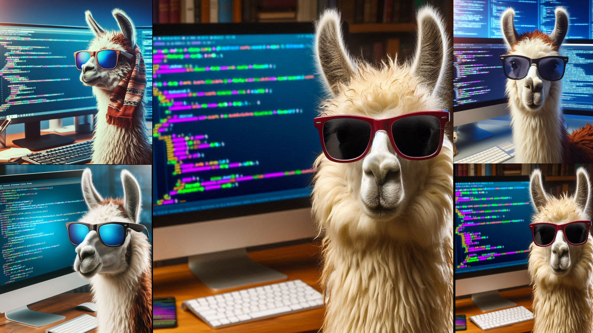
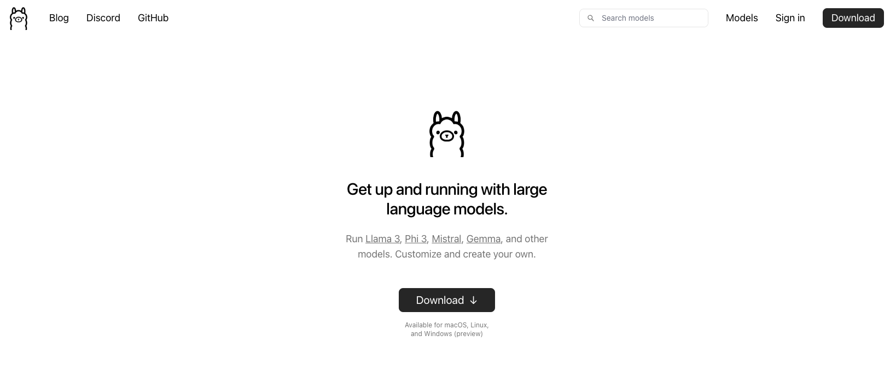
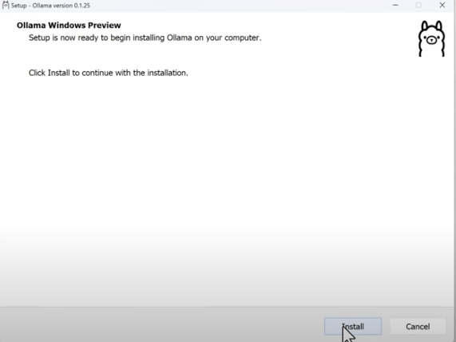
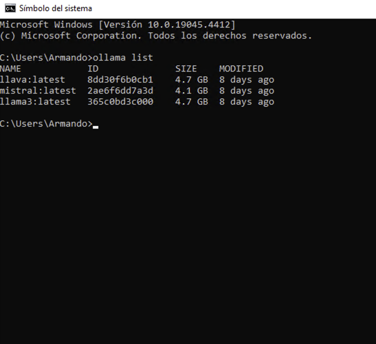

<h1 align="center">Código Ollama</h1>

<p align="center">  </p>

Los modelos de lenguaje de máquina (LLM) han emergido como herramientas esenciales en el campo de la inteligencia artificial y el procesamiento del lenguaje natural (PLN). Pero, ¿qué son exactamente estos modelos y por qué los de código abierto están ganando tanta relevancia? En este artículo, exploraremos el fascinante mundo de los LLM de código abierto, su importancia y tres de los modelos más destacados en este ámbito.

### ¿Qué es un modelo de LLM de código abierto?
Un modelo de LLM de código abierto es aquel cuyo código fuente está disponible libremente para que cualquiera pueda verlo, modificarlo y distribuirlo. Esto fomenta la colaboración y la innovación, permitiendo que la comunidad contribuya a su desarrollo y mejora continua.

## ¿Que es ollama ?
OLLAMA (Open Language Learning for Machine Autonomy) representa una iniciativa emocionante para democratizar aún más el acceso a los modelos de LLM de código abierto. Este proyecto tiene como objetivo desarrollar modelos avanzados y accesibles para una variedad de aplicaciones, desde la generación de texto hasta la traducción automática, con un enfoque en la transparencia y la ética.


## Guia de instalación
[]()
[]()

## Instaladando Ollama

### Paso 1.-  Descargar ollama
https://ollama.com/
<p align="center">  </p>

### Paso 2.-  Instalar ollama
<p align="center">  </p>

### Paso 3.-  Descargar un modelo

**Nota:Abrimos la termial o CMD**


Asi descargaremos el modelo llamado "llava"

```bash
ollama pull llava
```

Mostramos los modelos cargados

```bash
ollama list
```
<p align="center">  </p>

### Ejecuta ejemplos


<ul>
    <li>🦙 Vision Codigo  🔗</li>
</ul>


