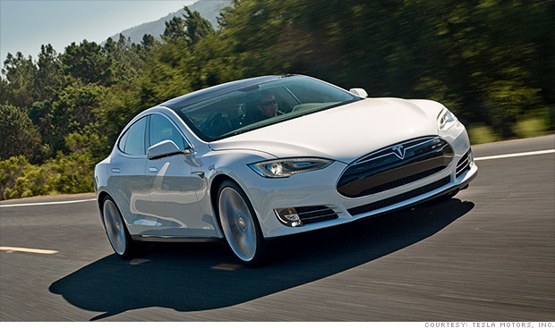

<h1 align="center">Ollama y Llava</h1>

LLaVA, que significa Asistente de Lenguaje y Visión de Gran Tamaño, es un modelo de inteligencia artificial multimodal de última generación que combina las capacidades de procesamiento del lenguaje natural y la visión por computadora para lograr una comprensión profunda tanto del texto como de las imágenes.

## Código
[]()
[]()


```bash
!pip install ollama
!pip install Image
!pip install pandas
!pip install transformers
!pip install torch
```

Importando Librerias

```python
import ollama
import glob
import os
import pandas as pd

from ollama import generate
from PIL import Image
from io import BytesIO
from transformers import AutoModelForCausalLM
```

Carga el data Frame de un CSV file o crea un nuevo si el archivo no existe.

```python
def load_df(filename):
    if os.path.isfile(filename):
        df = pd.read_csv(filename)
    else:
        df = pd.DataFrame(columns=['image_file','description'])
    return df
```

```python
def get_png_files(folder_path):
    return glob.glob(f"{folder_path}/*.png")
```

Metodo para procesar imagenes

```python
def process_image(image_file):
    print(f"\nProcesando {image_file}\n")
    with Image.open(image_file) as img:
        with BytesIO() as buffer:
            img.save(buffer, format='PNG')
            image_bytes = buffer.getvalue()

    full_response =''
    #Genera a desciption de la imagen
    for response in generate(
                    model='llava',
                    prompt='describe this image and make sure to include anything notable about it (include text you see in the image):',
                    images=[image_bytes],
                    stream=True):
        #Imprime la respueta para la terminal y agrega la respuesta
        print(response['response'],end='',flush=True)
        full_response += response['response']
    #Agrega una fila al data frame
    print(full_response)
    df.loc[len(df)] = [image_file,full_response]
```

#### Paso 1: Creamos el Data Frame
```python
df = load_df('image_descriptions.csv')
```

#### Paso 2: Cargamos la ruta donde estan las imagenes

```python
path_test = "./images"
image_files = get_png_files(path_test)
image_files.sort()

print(image_files[:1])
print(df.head())
```

#### Paso 3: Procesamos las images

```python
for image_file in image_files:
    if image_file not in df['image_file'].values:
        process_image(image_file)
```

#### Paso 4: Save the DataFrame to a CSV file
```python
df.to_csv('image_descriptions.csv', index=False)
```
#### Paso 5: Revisando la salida

<table>
    <tr>
        <td></td>
        <td>The image is a composite of two different photographs, showing a white Tesla Model 3 in motion on a road. In the top half, there's a blurred background that suggests speed, and it includes what appears to be a clear sky, vegetation, and possibly a mountainous landscape. The bottom half of the image shows the front of a silver sedan with distinctive features such as the Model 3's sleek design, including the aerodynamic hood, large front grille, and modern headlights.</td>
    </tr>
</table>


